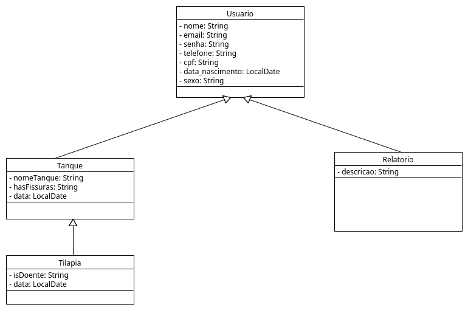
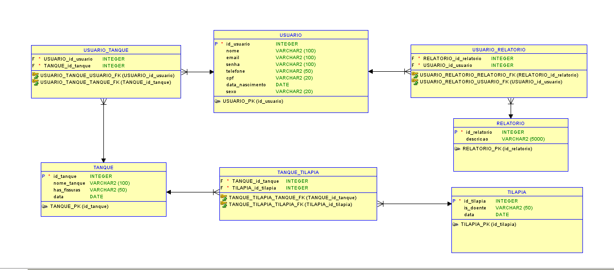

# AquaGuard-API

## Nome da aplicação;

AquaGuard

## Nome completo e breve apresentação dos integrantes do Grupo;

Gabriel Augusto Fernandes - RM98986

Kauê Fernandes Braz - RM97768

Mariana Trentino Albano - RM551154 

Matheus Dantas de Sousa - RM98406

Thomas Nícolas de Melo Mendonça - RM99832

## Instrução de como rodar a aplicação;

### Local
1. Baixar o extension pack do JAVA
2. Ir até o AQUAGUARD-API/src/main/java/com/globalsolutions/aquaguard/AquaGuardApplication.java
3. Clicar em Run para rodar a API
4. Pesquisar por localhost:8080
5. Colocar Infos necessárias para conectar no Banco Oracle pelo properties
7. Testar as requisições pelo Postman ou Insomnia

## Imagem dos diagramas;

### Diagrama UML

### Modelagem Banco de dados

### Testar requisições no Postman

[JSON da Collection do Postman](./Documentos/AquaGuard.postman_collection.json)
